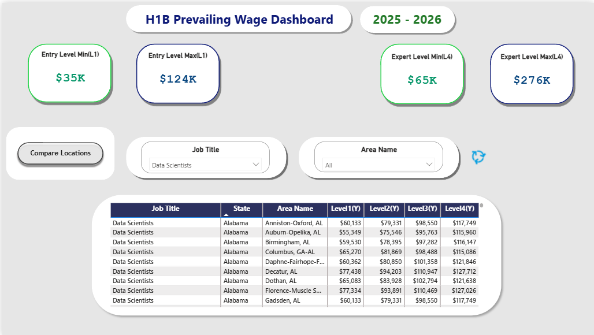
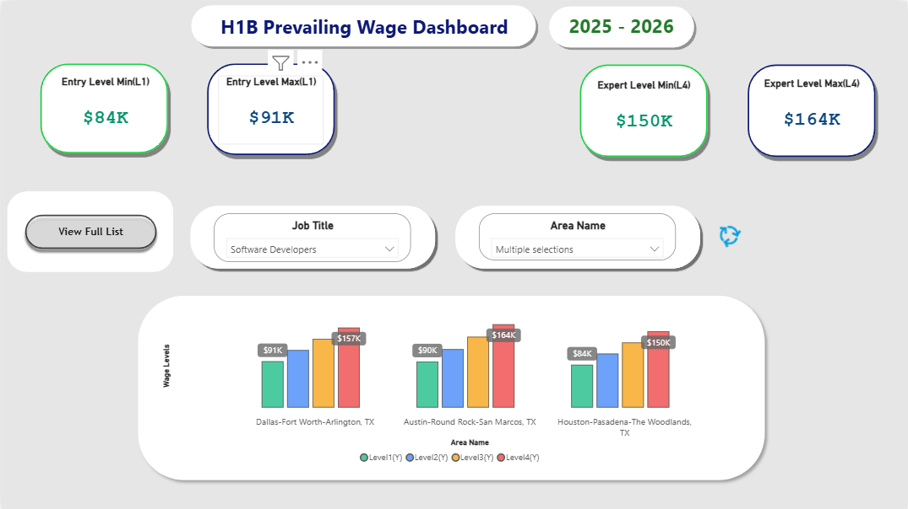

# H1B Prevailing Wage Dashboard

A Power BI dashboard that makes searching H1B prevailing wages actually usable.

## The Problem

The Department of Labor's OFLC wage search tool is painful to use:
- Requires knowing specific SOC codes
- One search at a time, no bulk comparison
- No way to quickly compare wages across regions
- Clunky interface that wastes time

If you've ever tried to look up prevailing wages for multiple locations, you know the frustration.

## The Solution

This dashboard lets you:
- Search any job title and see wages across all U.S. metro areas instantly
- Compare Entry Level (L1) through Expert Level (L4) side by side
- Filter by specific area
- Sort and explore data in seconds





## Why This Matters Now

Starting FY2027, the H1B lottery uses a wage-weighted selection system. Your wage level directly affects your lottery odds:

| Level | Lottery Entries |
|-------|-----------------|
| Level 1 (Entry) | 1 entry |
| Level 2 (Qualified) | 2 entries |
| Level 3 (Experienced) | 3 entries |
| Level 4 (Expert) | 4 entries |

The same salary can qualify for different wage levels depending on location. This dashboard helps identify those differences.

## Data Source

- U.S. Department of Labor OFLC
- Wage Year: 2025-2026
- Dataset: ALC_Export (All Labor Certifications)
- Records: 400,000+ covering all U.S. metropolitan areas

Data downloaded from: https://flag.dol.gov/wage-data/wage-library

## Tech Stack

- Power BI Desktop
- Power Query (data cleaning and transformation)
- DAX (measures and calculations)

## Data Cleaning Notes

The raw OFLC data required significant cleaning:

1. **Mixed wage formats** - Some rows contain hourly wages, others annual. Used the `Label` column to identify and standardize all values to annual wages (hourly × 2080).

2. **Incomplete records** - Filtered out rows labeled "High Wage" and "No Leveled Wage" that lacked Level 1-4 breakdown.

3. **Lookup tables** - Created relationships with Geography (Area to AreaName/State mapping) and SOC crosswalk (SOC codes to job titles).

## Features

- Dynamic KPI cards showing min/max wages for selected filters
- Job title search with 800+ occupations
- State and metro area filters
- Visual comparison chart across regions
- Detailed data table with export capability

## File Structure
```
h1b-wage-navigator/
├── H1B_Wage_Navigator.pbix    # Power BI file
├── data/
│   ├── ALC_Export.csv         # Main wage data
│   ├── Geography.csv          # Area code to name mapping
│   └── xwalk_plus.csv         # SOC code to job title mapping
├── screenshots/
│   ├── dashboard-overview.png
│   └── data-table.png
└── README.md
```

## Limitations

- Cannot publish publicly (created with educational Power BI account)


## Future Updates

- Add Top 10 Lowest / Top 10 Highest toggle for wage comparison
- Include lottery odds context on dashboard
- Refresh with new wage data when released

---

Built by Narasimha Royal | https://narasimharoyal.com
